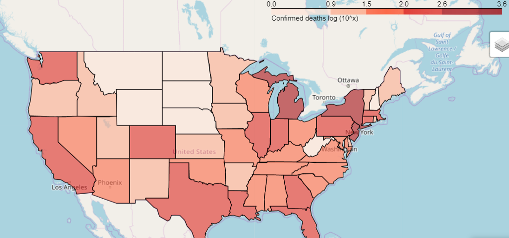

# COVID 19 in the US

## Plamen Dzhelepov
[Linkedin](https://www.linkedin.com/in/pdzhelepov) | [Github](https://github.com/plamengj) | [Slides](/presentation/COVID-19 USA EDA.pptx)

## Table of Contents

* [Overview and Motivation](#overview-and-motivation)
* [Data](#data)
  * [Description](#description)
* [Exploration](#exploration)
* [Conclusion](#conclusion)
* [Future Directions](#future-directions)

## Overview and Motivation
COVID-19 is a deadly virus the likes of which we haven’t seen in the past 100 years and it affects everyone in the US and internationally. It is on everyone’s mind currently (Apr 2020). We are all affected by it, especially our daily lives, we are not allowed to socialize and must work from home. And we are all paying attention to it and wondering when there will be a vaccine and whether and when we will return to our normal lives. We are trying to figure out as much as possible, in terms of gathering data, analyzing it, in order to take measures and prevent the further spread.

## Data
### Description
John Hopkins University Center for System, Science and Engineering, a research collective housed within the Department of Civil and Systems Engineering (CaSE) at Johns Hopkins University (JHU), has compiled a series of [datasets](https://github.com/CSSEGISandData/COVID-19) of COVID-19 related information. I have used 2 of their datasets, a time-series one broken down by country and state and a snapshot data (total cases & dates by that date) one broken down by state and county.

At a high level, the datasets contain information about the daily fluctuations of cases and deaths related to COVID-19 and a breakdown in terms of counties and states.

I have used pandas and dataframes to examine, plot and analyze this subset of data.

## Exploration
This section contains plots that demonstrate the types of information that can be gleaned from this feature-rich data set.

### Number of cases/deaths in the US - total, per state, per county
| Cases |	Deaths |	Mortality Rate |
|:---:|:--:|:--:|
|Total |	308850 |	8407 |	2.72|

|State|	Cases	|Deaths|
|:---:|:--:|:--:|
|New York |	113833 |	3565
|New Jersey |	34124	| 846
|Michigan	| 14225	| 540
|California	| 12837 |	289
|Louisiana|	12496|	409
|Massachusetts|	11736|	216
|Florida |	11545 |	195
|Pennsylvania	| 10444 |	136
|Illinois |	10357 |	244
|Washington	| 7247	| 315

|County | State	| Cases|	Deaths
|:---:|:--:|:--:|:--:|
|New York City|	New York|	63306|	1905
|Nassau |	New York|	13346|	95
|Westchester|	New York|	13081|	67
|Suffolk|	New York|	11370|	124
|Cook	|Illinois	|7439|	167
|Wayne|	Michigan|	6762|	252
|Bergen	|New Jersey|	5760|	179
|Rockland|	New York|	4872|	69
|Los Angeles|	California|	4605|	93
|Orleans|	Louisiana|	3966|	153

These are tables of the number of cases/deaths by state/county in the US

### Cases/Deaths by State/County in the US

 

 

These are plots of the number of cases/deaths by state/county in the US

### Choropleth map of the number of deaths by COVID-19 by state

This is a choropleth map showing the deaths per state.

### COVID-19 Cases USA (daily growth)

This is a plot showing the daily growth in cases and deaths in the US from Jan to Apr 2020 with a total for both in the legend.

## Conclusions
There are several hotspots in the US in terms of cases and deaths concentrated in the Northeast. But the virus is quickly spreading, and other hotspots are forming.

## Future Directions
As more data comes in about COVID-19, I can investigate income levels, BCG vaccine, density and their relationship with the number of cases in each state/county/country.